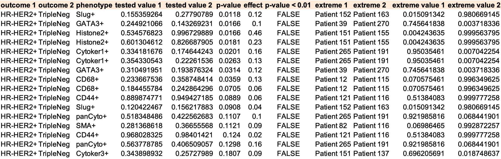
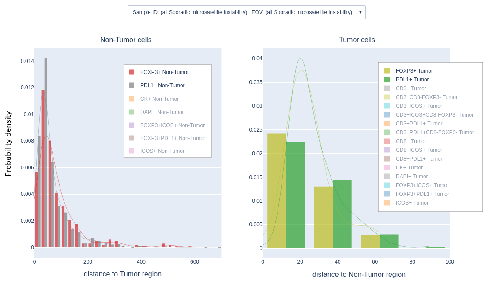

<p align="center">

</p>
<p align="center">
<a href="https://github.com/nadeemlab/SPT#Supported-workflows">Supported workflows</a>
 | <a href="https://github.com/nadeemlab/SPT#Preparing-your-data">Preparing your data</a>
 | <a href="https://github.com/nadeemlab/SPT#Prerequisites">Prerequisites</a>
 | <a href="https://github.com/nadeemlab/SPT#Getting-started">Getting started</a>
 | <a href="https://github.com/nadeemlab/SPT#Examples">Examples</a>
 | <a href="https://spatialprofilingtoolbox.readthedocs.io">Read the Docs</a>
 | <a href="https://nadeemlab.github.io/SPT/maintenance.html">Maintenance</a>
</p>

The Spatial Profiling Toolbox (SPT) is a lightweight deployment framework for image analysis computation in the context of histopathology. The pipelines are orchestrated with [Nextflow](https://www.nextflow.io/) and support [Singularity](https://sylabs.io/guides/latest/user-guide/)/[Docker](https://hub.docker.com/r/nadeemlab/spt) containerization.

Workflows
---------
The basic workflows compute:
- **Phenotype proximity metrics**. The average density with which a cell of one set appears within a specified distance from a given cell of another set.
- **Density metrics**. Without regard to spatial information, cell counts per unit cell area in a given compartment or region belonging to a given phenotype.
- **Front proximity workflow**. The distribution of the distances between the cells of a given subset and the front or boundary between two given regions.

A further workflow provides support for [importing multiplexed imaging cell data](https://github.com/nadeemlab/SPT#import-halo-data-into-normal-form) into a normalized database. Additional workflows using third-party libraries can be added with minimal overhead.

Preparing your data
-------------------
The current workflows all operate on spreadsheet files mimicing that of object/cell manifests exported from the [HALO](https://indicalab.com/halo/) software.

In the future all workflows will operate on [Pathology ADI-compliant](https://adiframework.com/docs_site/pathology_quick_reference.html) datasets.

Prerequisites
-------------
The instructions are basically the same whether you will be running on your local machine, on a High-Performance Cluster for large datasets, or another runtime context, with slight differences noted where applicable.

1. Ensure a Linux/Unix-style environment.
2. Install [Java 8+](https://www.java.com/en/download/manual.jsp). This is needed for Nextflow.
3. Install [Nextflow](https://nextflow.io/).

Getting started
---------------
To get the SPT tools, do one of the following:

1. Install the SPT tools from [PyPI](https://pypi.org/project/spatialprofilingtoolbox/):
   ```sh
   $ pip install spatialprofilingtoolbox
   ```
2. If your environment has a [Singularity](https://sylabs.io/guides/latest/user-guide/) installation, pull the SPT container image from Docker Hub into a directory of your choice:
   ```sh
   $ cd /path/to/my/containers/
   $ singularity pull docker://nadeemlab/spt:latest
   ```

Navigate to a working directory for your run, and configure it with `spt-configure`. The options are shown below:

```
$ spt-configure -h

usage: spt-configure [-h]
 --workflow {HALO import,phenotype density,front proximity,phenotype proximity}
 --input-path INPUT_PATH
 [--sif-file SIF_FILE]
 (--local | --lsf)
 [--excluded-host EXCLUDED_HOST]
 [--database-config-file DATABASE_CONFIG_FILE]

Configure an SPT (spatialprofilingtoolbox) run in the current directory.

optional arguments:
  -h, --help            show this help message and exit
  --workflow {phenotype density,front proximity,phenotype proximity}
  --input-path INPUT_PATH
                        Path to directory containing input data files. (For example, containing file_manifest.tsv).
  --sif-file SIF_FILE   Path to SPT Singularity container. Can be obtained with singularity pull docker://nadeemlab/spt:latest
  --local               Use this flag to get Nextflow to deploy processes locally on a given machine.
  --lsf                 Use this flag to get Nextflow to attempt to deploy processes as Platform LSF jobs on an HPC cluster.
  --excluded-host EXCLUDED_HOST
                        If a machine must not have LSF jobs scheduled on it, supply its hostname here.
  --database-config-file DATABASE_CONFIG_FILE
                        If workflow involves database, provide the config file here.
```

**Note**: *If you didn't `pip install`, you can run the configuration script out of the container:*

```sh
$ singularity exec -B /path/to/my/data -B /path/to/my/containers /path/to/my/containers/spt_latest.sif spt-configure ...
```

**Note**: *In a limited-permissions environment, [miniconda](https://docs.conda.io/en/latest/miniconda.html) can be used to install git, Python, and gxx (for sklearn), and then install `spatialprofilingtoolbox` from the source in this git repository, all into a conda-managed virtual environment.*

Example configuration run:
```sh
$ spt-configure \
 --workflow='phenotype density' \
 --input-path=/path/to/my/data \
 --local
```

If the `--sif-file` option is provided, Nextflow will be instructed to run all of the workflow processes in the supplied container.

Finally:

```sh
$ nextflow run .
```

**Note**: *Want to customize your run? Feel free to add or alter settings in the* [`nextflow.config`](https://www.nextflow.io/docs/latest/config.html) *file created in your working directory. You can also fine-tune the workflow definition itself by editing* `main.nf`.

### LSF
The pipeline seamlessly supports High-Performance Clusters (HPCs) running [Platform LSF](https://www.ibm.com/products/hpc-workload-management). Just add the `--lsf` option to `spt-configure`.

### Monitoring output
SPT generates verbose logs, which Nextflow sends to files `work/*/*/.command.log` .

A convenient way to monitor these is:
```sh
$ tail -f $(find work/*/*/\.command.log)
```

Since new log files are created as the workflow progresses, you may need to run this command multiple times.

Once the run is complete, you can generate a summary of the jobs with:
```sh
$ spt-report-on-logs
```

*Note*: `spt-report-on-logs` *will search for run directories recursively starting at the current directory, and report on all the runs.*

### Import HALO data into normal form
The input, intermediate, and output data pertaining to the pipelines is described by a fully-documented data model, the [Pathology ADI](https://adiframework.com/docs_site/pathology_quick_reference.html) ("Application Data Interface"). The model documents 104 fields in 22 tables. 61 entity types with 36 property types are annotated with definitions, with 73% coverage by references to independently-maintained ontologies.

To import HALO-exported cell object files into a normalized database conforming to the Pathology ADI:
1. Set up a PostgreSQL database (e.g. on your local machine).
2. Save [`~/.spt_db.config`](https://github.com/nadeemlab/SPT/blob/main/spatialprofilingtoolbox/templates/.spt_db.config.template):
   ```
   [database-credentials]
   database = <database name>
   endpoint =  <host name or endpoint>
   user = <user you use for database access>
   password = <password>
   ```
3. Set up the database schema:
   ```
   spt-create-db-schema --database-config-file=~/.spt_db_config
   ```
4. Prepare your data in the format exemplified in [tests/data_subspecimens/](https://github.com/nadeemlab/SPT/tree/main/tests/data_subspecimens).
5. Run the `'HALO import'` workflow, for example:
   ```sh
   spt-configure --local --input-path=/path/to/data --workflow='HALO import' --database-config-file=~/.spt_db.config
   ./run.sh
   ```
6. (Optional) Compute summary views:
   ```sh
   spt-create-db-schema --database-config-file=~/.spt_db.config --refresh-views-only
   ```

*Note*: The import workflow can be sped up substantially by wrapping the run command in commands that teardown/recreate certain constraints, as follows:

```sh
spt-db-constraints --database-config-file-elevated=~/.spt_db.config --drop
./run.sh
spt-db-constraints --database-config-file-elevated=~/.spt_db.config --recreate
```

*Note*: The credentials file is not copied by the workflow, and the password is stored in memory only long enough to establish a connection to the database.

Examples
--------
The dataset analyzed in the following examples is imaging mass cytometry of breast cancer tissue microarrays, published [here](https://doi.org/10.5281/zenodo.3518283). For the purpose of phenotyping, continuous intensity values were dichotomized using a [log transformation and 2-population Gaussian mixture model](https://github.com/nadeemlab/SPT/blob/main/spatialprofilingtoolbox/environment/dichotomization.py).

### Phenotype proximity workflow
A basic question concerning the spatial information provided by cell imaging is: What characterizes the spatial relationship between the arrangements of cells belonging to two given phenotypes?

As an answer to this question, here we calculate:

**phenotype proximity metric**: *The average number of cells of a given target phenotype which occur within a prescribed (pixel) distance of a given cell of a given source phenotype, the average being over all such cells, i.e. those of the source phenotype*.

High values for this metric may be due to overall higher counts for the target phenotype, as opposed to any spatial phenomenon. However, for small distance limits, comparatively high values for the proximity metric may indicate that the cells of the target phenotype are somehow attracted to or stimulated by cells of the source phenotype.

The results of this pipeline are saved to `results/stats_tests.csv`. The most significant rows for a given pair of outcome values (in this case diagonosed intrinsic subtypes) are shown below:

<p align="center">

</p>

Each row records the result of a test for statistically-significant difference between the values of the phenotype proximity metric in 2 different sample groups, when restricted to a given region or compartment of a given image when regional information is available.

### Density workflow

Some biological phenomena may be detectable already in dissociated "signal" not involving the spatial information present in images.

One of the simplest and most readily available metrics for dissociated cell populations in histology slides is:

**phenotype density**: *The fraction of the cell area occupied by cells of a given phenotype, out of the total cell area*.

The results of this pipeline are saved to `results/stats_tests.csv`. If no cell area data is provided, a default constant value is used. Example rows from this table are shown below:

<p align="center">

</p>

Each row records the result of a test for statistically-significant difference between the values of the density metric in 2 different sample groups, when restricted to a given region or compartment of a given image.

**Intensity information**. Cells may be weighted by the intensity value of a given channel in the density calculation.

### Front proximity workflow

The histology images and metadata supporting this example and the following example are a colon cancer dataset that will be made publicly available.

For a cell in a given biologically-meaningful region, distance to the front or boundary with a specific other region may be an important indicator of the probability of participation in processes of interaction between the two regions. For example, between tumor and stromal regions.

In this workflow we calculate:

**front proximity metric**: *the distance from each cell to the front between two given regions*.

The values are then stratified by cell phenotype and saved to the SQLite database `results/intermediate.db`. The table `cell_front_distances` includes columns:

- `sample_identifier`
- `fov_index`
- `outcome_assignment`
- `phenotype`
- `compartment`
- `other_compartment`
- `distance_to_front_in_pixels`

To see plots of the distributions, use:

```sh
spt-front-proximity-viz results/intermediate.db --drop-compartment="<ignorable compartment name>"
```

**Note**: *The* `--drop-compartment` *option should be provided as many times as necessary to remove from consideration all compartments/regions in excess of the two you wish to focus on. If only two compartment designations appear in your metadata files, then this option is not necessary.*

Plot rendering for about 500 MB (8 million cells) took 5 minutes on a workstation laptop. To monitor the progress, enable [debug logs](#Logs).

<p align="center">

</p>

## License
© [Nadeem Lab](https://nadeemlab.org/) - SPT code is distributed under **Apache 2.0 with Commons Clause** license, and is available for non-commercial academic purposes. 


Papers Using SPT
----------------

Vanguri et al. **Tumor immune microenvironment and response to neoadjuvant chemotherapy in hormone receptor/HER2+ early stage breast cancer**. *Clinical Breast Cancer*, 2022. [[Read Link]](https://doi.org/10.1016/j.clbc.2022.04.002)
