<p align="center">

</p>
<br/>
<br/>

- [What do cell profiles tell us about biology and disease?](#what-do-cell-profiles-tell-us-about-biology-and-disease)
- [User tutorial](#user-tutorial)
  - [Example: Exploratory data analysis of immunotherapy response in melanoma](#example-exploratory-data-analysis-of-immunotherapy-response-in-melanoma)
  - [Spatially-informed metrics](#spatially-informed-metrics)
- [Data management](#data-management)
- [CLI command reference](#cli-command-reference)
  - [Dataset uploader](#dataset-uploader)
- [API reference](#api-reference)
- [Development and maintenance](#development-and-maintenance)
- [Deployment options](#deployment-options)
  - [License](#license)

# What do cell profiles tell us about biology and disease?

By studying microscopic images of specimens of tissue, like skin or organ resections, pathologists and basic scientists can draw inferences about the way that cells coordinate to set biological processes in motion, and how these processes are disrupted in the course of disease.

The taxonomy of cell types and their functional states is surprisingly diverse, and modeling biological processes at the cellular level is consequently a rich source of new insights. Imaging methods are needed that capture some of this diversity, by measuring multiple channels of information at the same time for each cell, to provide empirical data that ensures these models make sense in realistic scenarios.

Multiple-channel imaging technology, capable of measuring several dozen protein targets, is reaching maturity. Multiplexed immunofluoresence, imaging mass cytometry, and their variants measure data similar to what is measured by flow cytometry or single-cell RNA-seq, since this is also at the single-cell level and involves multiple quantitative features, but with the crucial advantage that cell positions are also observed -- spatial context.

The Spatial Profiling Toolbox (SPT) project is about making the most of this informative data source using quality software. The guiding principles are:

|       |                      |         |
|-------|----------------------|---------|
| :zap: | **High availability** | Datasets should be available for analysis immediately with the widest range of tools. Preprocessing and indexing should be done in advance as much as possible.|
| :repeat: | **Reproducible analysis** | Results and findings should be based on analyses that others can easily recreate in their entirety. |
| :computer: | **No code** | The tools should be usable by investigators without doing any programming and without the need for specialized knowledge of computer systems. |
| :white_check_mark: | **Uniform data management** | Datasets should be organized with high semantic integrity, to ensure analysis can be performed on them in a consistent way and to ensure that the conclusions that are drawn are valid.|

SPT is available to the public at [oncopathtk.org](https://oncopathtk.org).

<p align="center">
<a href="docs/image_assets/diagram_medium_res.png">
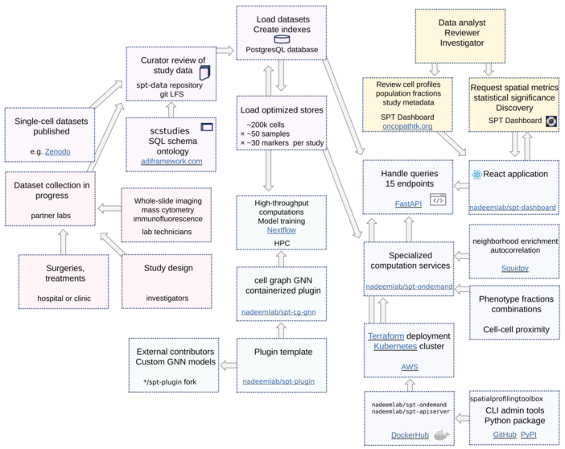
</a>
</p>

# User tutorial

## Example: Exploratory data analysis of immunotherapy response in melanoma

On the main page, select **Melanoma CyTOF ICI**. This brings up a dataset that was collected and published by Moldoveanu et al.[^1].

You'll see a summary of this dataset, including the numbers of samples, cells, and channels, links to relevant publications, classification of the samples, and highlighted findings that can be observed by using the SPT application. In this case the study collected samples from patients treated with immune-checkpoint inhibitor therapy, and the patients either responded favorably or poorly to this treatment.

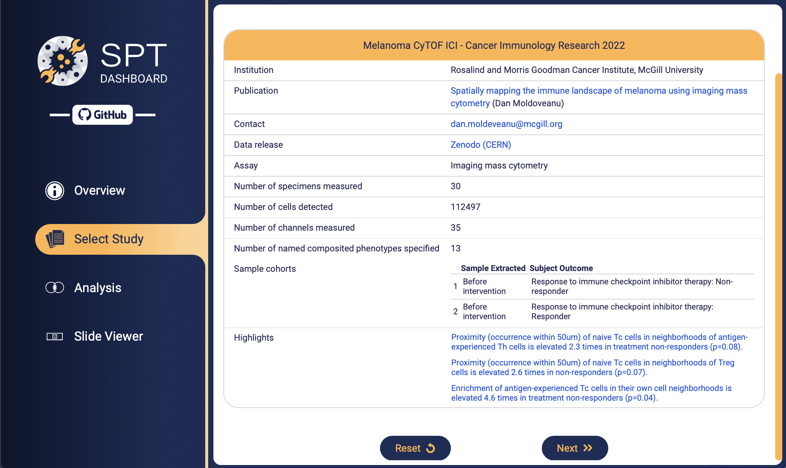

On the next page you can choose which cell phenotypes you want to focus on. Click one of the pre-defined phenotypes, or define a custom phenotype by indicating positive and negative markers from among the channels which were imaged.

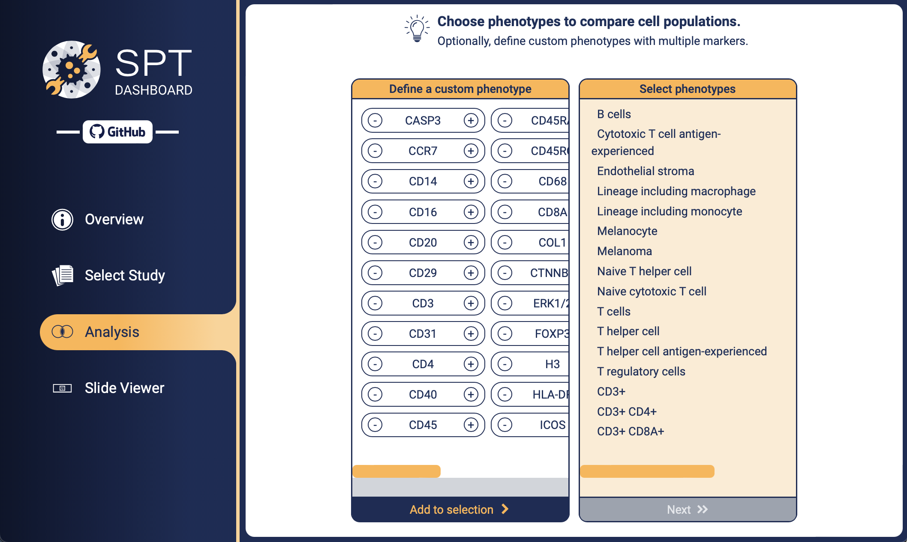

We select five custom phenotypes. The first phenotype, for example, was defined by clicking the **+** beside **CD3+**, then clicking **Add to selection**. This generally indicates the T cells. The second phenotype is **CD3+ CD4+**, the markers of T helper cells. We also include: **CD3+ CD8A+**, **CD3+ CD4+ FOXP3+**, and **CD20+ CD3-**. We are ascertaining the rough profile of lymphocytes in the dataset.


The next page shows the cell population breakdown with respect to the phenotypes we've just selected. Each phenotype is shown with the fraction of cells expressing that phenotype across all samples, for example 54.02% are indicated as T cells.

In the grid, each *pair* of phenotypes is shown with the fraction of cells expressing *both* phenotypes. For example, the fraction of cells that are both **CD3+ CD4+ FOXP3+** and **CD3+** is 16.53%, the same as the fraction of cells that are **CD3+ CD4+ FOXP3+**, as expected since **CD3+** is part of the signature of this phenotype (the T regulatory cells).

> [!NOTE]
> :bar_chart: You could use this technique to make a standard heat map for assessment of clusters, by selecting all single-channel phenotypes. Depending on the size of the samples, since these metrics are computed live, this could take up to 1 minute per computed value, and sometimes longer.

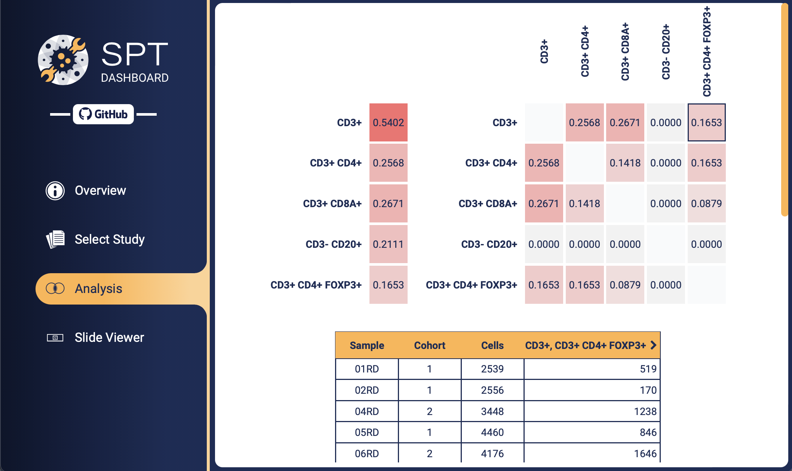

To continue with a finer analysis, click one of the "tiles", either for one phenotype (the tiles on the left) or two phenotypes (the grid on the right).

We choose the tile at row **CD3+ CD4+ FOXP3+** (Treg) and column **CD3+ CD8A+** (Tc). The table below populates with the size of the population of cells expressing both signatures, broken down by sample. Note that in reality there are generally few cells expressing both of these two specific suites of markers, and the few cells occuring here are probably the result of an imperfect stain intensity dichotomization (thresholding, gating). So this tool can be used to do basic quality control in case some logical or illogical marker combinations are known in advance.

We also selected the single-phenotype tiles **CD3+ CD4+ FOXP3+** and **CD3+ CD8A**.

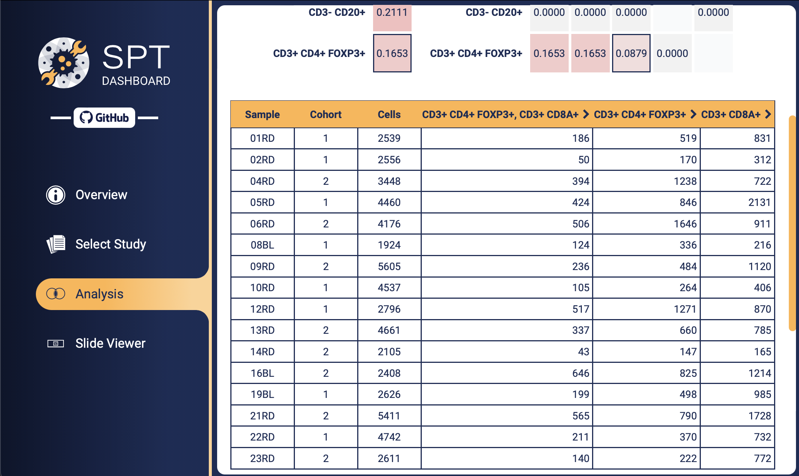

Click on the column header **CD3+ CD8A+** (it becomes underlined to indicate that it is selected). Then select the two cohorts by clicking one of the **1** values and one of the **2** values. A "verbalization" appears which states that the trend, according to a t-test, is that the fraction of Tc cells is increased about 1.5 times in the non-responder cohort compared to the responders, with statistical significance value p=0.01.

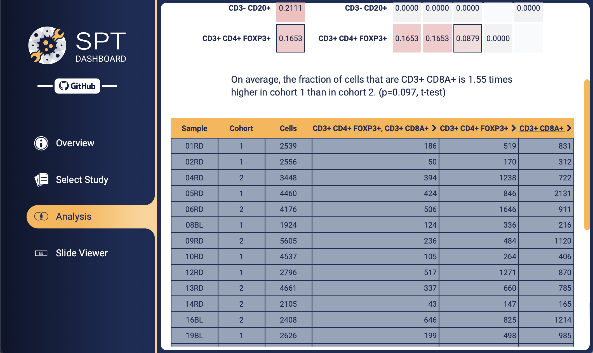

We click on column **CD3+ CD4+ FOXP3+**, in addition to the prior selection. A similar assessment appears, this time with respect to the ratio of the number of **CD3+ CD8A+** (the first selection) to **CD3+ CD4+ FOXP3+** (the second selection).

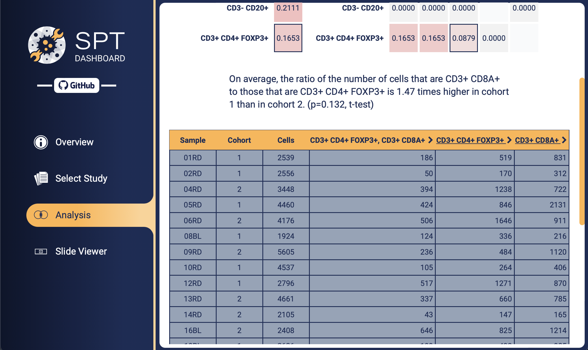

Let's focus our attention on one of the samples that exhibited a large fraction of Tc cells. Click **31RD**.

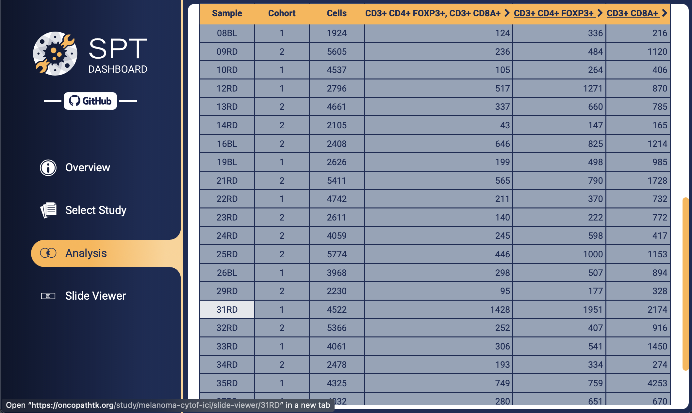

The "virtual slide viewer" opens. Choose a few phenotypes, and the corresponding cells will become highlighted. The fraction and count of the cells for each phenotype are shown.

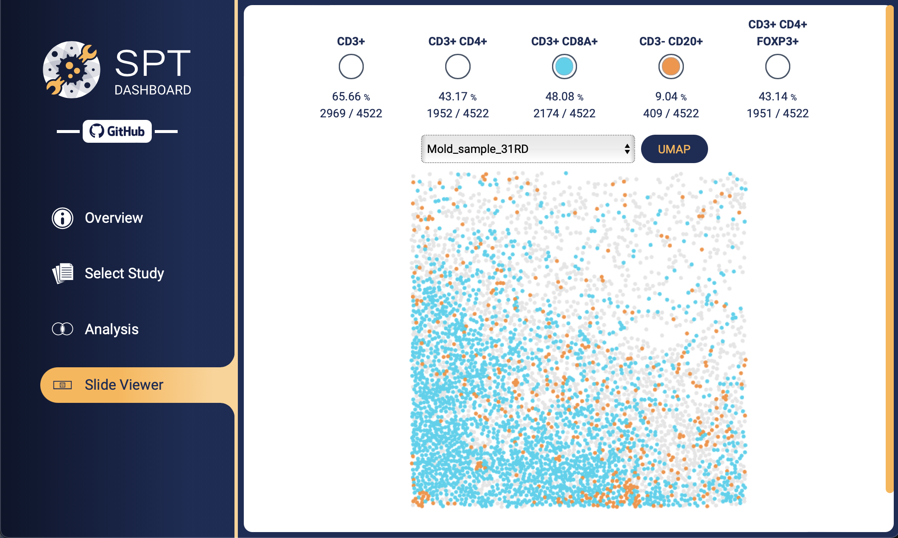

A UMAP dimensional reduction of the cell set across the whole data collection is available in this case. Click **UMAP**.

> [!NOTE]
> :mag: You can zoom and pan the view using scroll and click-and-drag.

We spot a region that looks "saturated" with Tc cells. Select it by clicking and dragging the mouse while holding either the **Ctrl** key or (on Mac) **CMD**.

The new cell count for each phenotype is now shown, together with the new percentage, relative to the selection. In this case the Tc fraction approximately doubled, to **6996** cells (shown in green). This increase is assessed using the Fisher test (the entire contingency table is also shown, for reference). The test verifies that the increase is highly statistically significant in this case, as expected.

> [!NOTE]
> :dna: By careful use of the selection tool, noting enrichments in each virtual region, you can account for most of the cell types present and hone the focus of study.

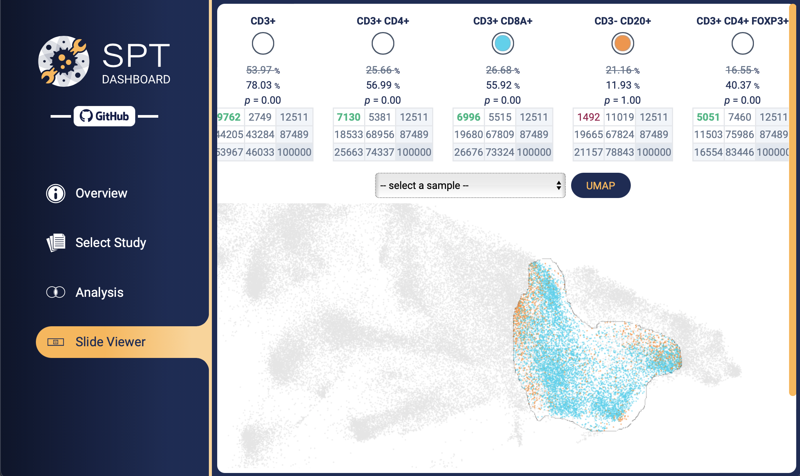

## Spatially-informed metrics

Let's see an example of quantification over samples that makes use of the spatial arrangement of cells.

Choose the phenotypes **Naive cytoxic T cell** and **T helper cell antigen-experienced**. Select the tile with row **T helper cell antigen-experienced** and column **Naive cytoxic T cell**, representing the pair of phenotypes.

In the column header that appears, click `>`. The **spatial metrics** dropdown appears. Click `v` to show the available metrics. Choose **cell-to-cell proximity**. After the metric is finished computing, click the column header **cell-to-cell proximity** and the two cohorts **1** and **2** to perform a univariate comparison.

This metric is the average number of **Naive cytotoxic T cells** appearing within a specified radius of given **T helper antigen-experienced** cells. It measures generally how common it is to find cells of one phenotype in close proximity to those of another phenotype. There are several other metrics available, of various degrees of statistical sophistication, many computed using the [Squidpy](https://squidpy.readthedocs.io/en/stable/) package. These are explained in more detail in the [API documentation](#api-reference).

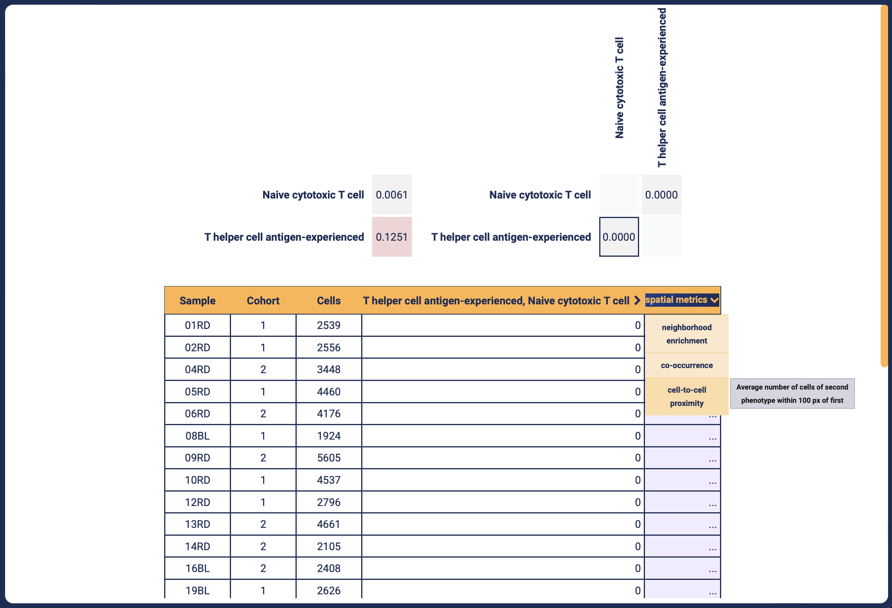

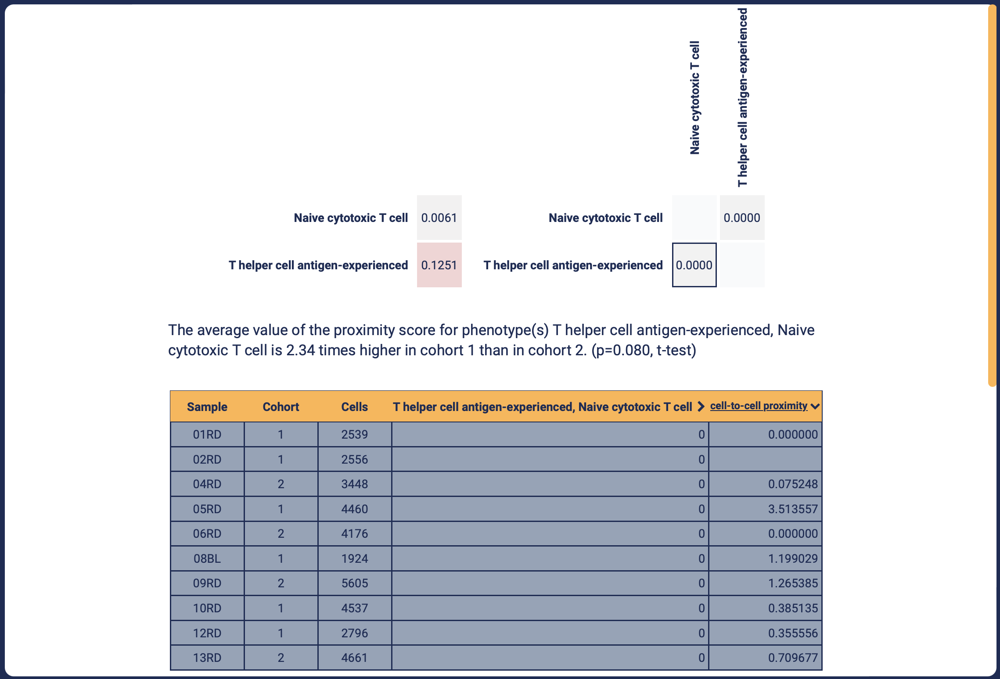

> [!NOTE]
> :clipboard: You can **save results like this for later** by copying the URL in the address bar. In fact, this result is highlighted on the study summary page. Try reproducing it by following the first link as shown below.

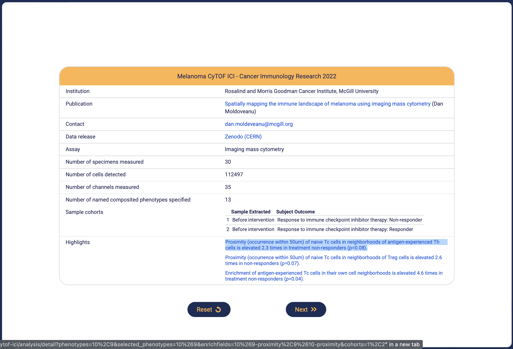

# Data management
To support this project's semantic integrity goals, we designed a general data model and ontology for cell-resolved measurement studies, using a schema-authoring system we call the Application Data Interface (ADI) framework.

The schema is called `scstudies` and it is documented in detail [here](https://adiframework.com/docs_site/scstudies_quick_reference.html#).

In our implementation, we sought to strike an effective balance between the completeness of annotation demanded by accurate record-keeping, on the one hand, and practical computational efficiency on the other. Much of the application is organized around a SQL database with a schema that conforms tightly to the formal `scstudies` data model, but we also make liberal use of derivative data artifacts to improve speed and performance. For example, a highly-compressed [binary format](docs/cells.md) is adopted for transmission of a given sample's cell-feature matrix.

Similarly, datasets that we have curated for uniform data import are stored in a simple tabular file format which does not generally support all the features of the `scstudies` model. This intermediary format is designed for ease of creation and it is not entirely formalized. For an example, see [data_curation/](data_curation/).

# CLI command reference
The Python package `spatialprofilingtoolbox` is released on [PyPI](https://pypi.org/project/spatialprofilingtoolbox/), so it can be installed with

```sh
python -m pip install spatialprofilingtoolbox
```

Installation makes several commands available in the shell. List them with `spt`:

```sh
$ spt
...

spt apiserver dump-schema

spt graphs create-specimen-graphs
spt graphs explore-classes
spt graphs extract
spt graphs finalize-graphs
spt graphs generate-graphs
spt graphs plot-importance-fractions
spt graphs plot-interactives
spt graphs prepare-graph-creation
spt graphs upload-importances

spt db collection
spt db delete-feature
spt db do-fractions-tests
spt db drop
spt db drop-ondemand-computations
spt db guess-channels-from-object-files
spt db interactive-uploader
spt db list-studies
spt db load-query
spt db retrieve-feature-matrices
spt db status
spt db upload-sync-small

spt ondemand cache-expressions-data-array
spt ondemand start

spt workflow aggregate-core-results
spt workflow configure
spt workflow core-job
spt workflow generate-run-information
spt workflow initialize
spt workflow merge-performance-reports
spt workflow report-on-logs
spt workflow report-run-configuration
spt workflow tail-logs
```

Each command will print documentation by providing the `--help` option.

Several commands are mainly for use internal to the application components.

Some others are TUIs (Terminal User Interfaces) meant to make common tasks, like uploading datasets or inspecting cache or metadata, more reliable.

## Dataset uploader
`spt db interactive-uploader` is a TUI that automatically determines available data sources and targets after you have created or located source datasets (format: [data_curation/](data_curation/)). It looks for [database configuration files](spatialprofilingtoolbox//workflow/assets/.spt_db.config.template) named `~/.spt_db.config.*`, checks the environment variable `SPT_S3_BUCKET`, and searches recursively for datasets in the current working directory named `generated_artifacts`. It presents available options and initiates the upload process.

Example usage is shown below.

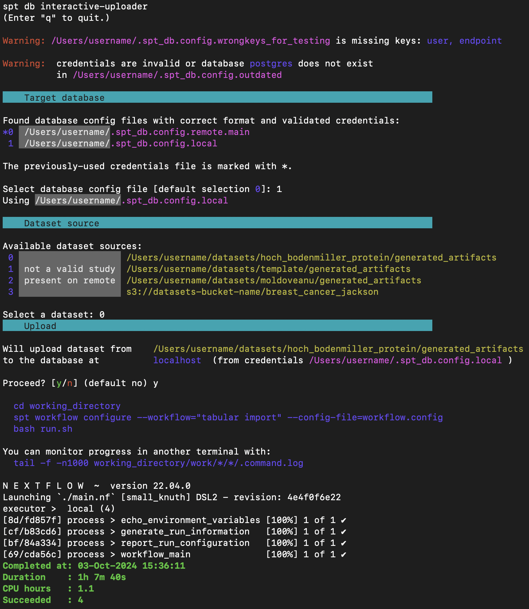

The ETL (Extract/Transform/Load) process includes a number of data integrity checks and the creation of several intermediate data artifacts.

# API reference
The SPT application is supported by a web API, which provides fine-grained access to specific components of a given dataset. The API is documented [here](https://oncopathtk.org/api/redoc).

# Development and maintenance
See [docs/maintenance.md](docs/maintenance.md).

# Deployment options
For assistance setting up a deployment of the SPT application for your institution or business, write to us at [nadeems@mskcc.org](nadeems@mskcc.org).

The application can be deployed in several ways:

- As manually-managed services on a single server
- Using Docker compose
- On a Kubernetes cluster using a cloud provider


[^1]: Moldoveanu et al. [*Spatially mapping the immune landscape of melanoma using imaging mass cytometry*](https://doi.org/10.1126/sciimmunol.abi5072)

## License
© [Nadeem Lab](https://nadeemlab.org/) - SPT code is distributed under **Apache 2.0 with Commons Clause** license, and is available for non-commercial academic purposes. 
