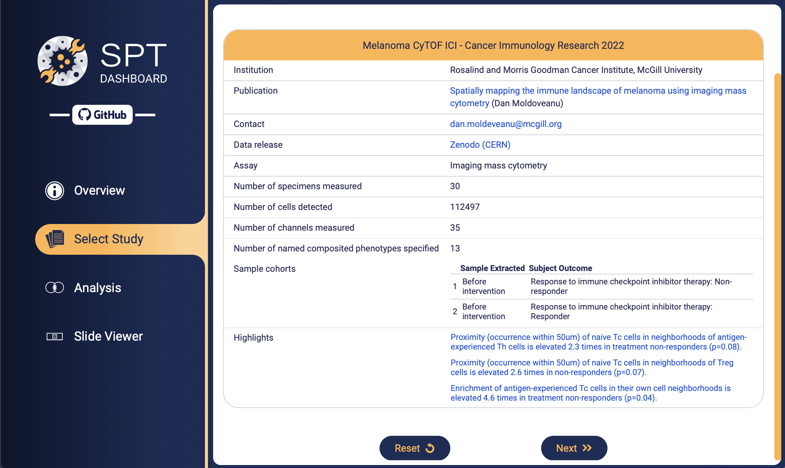
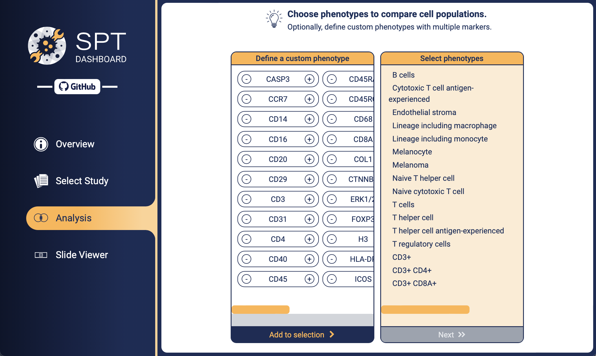
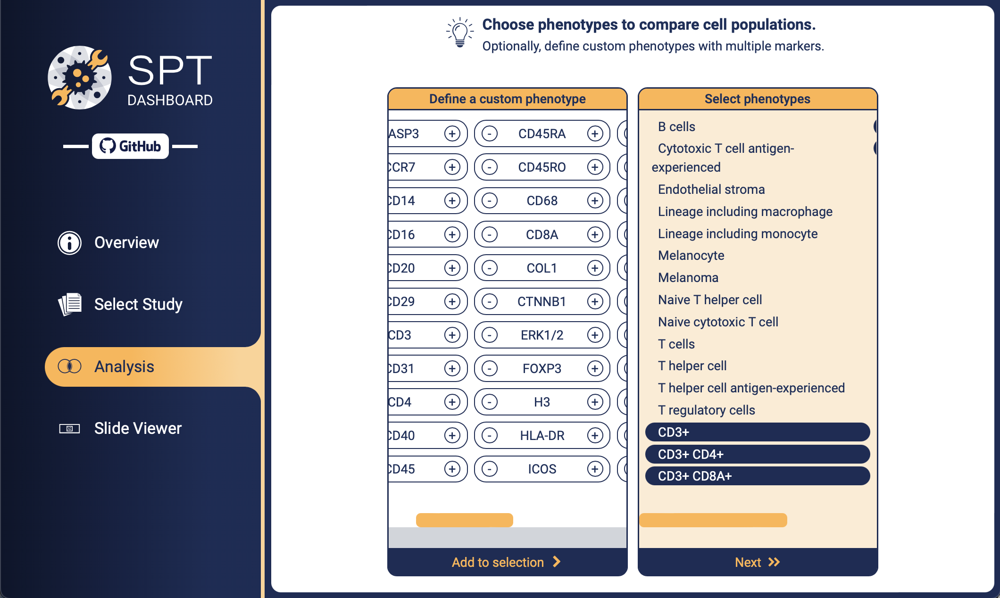
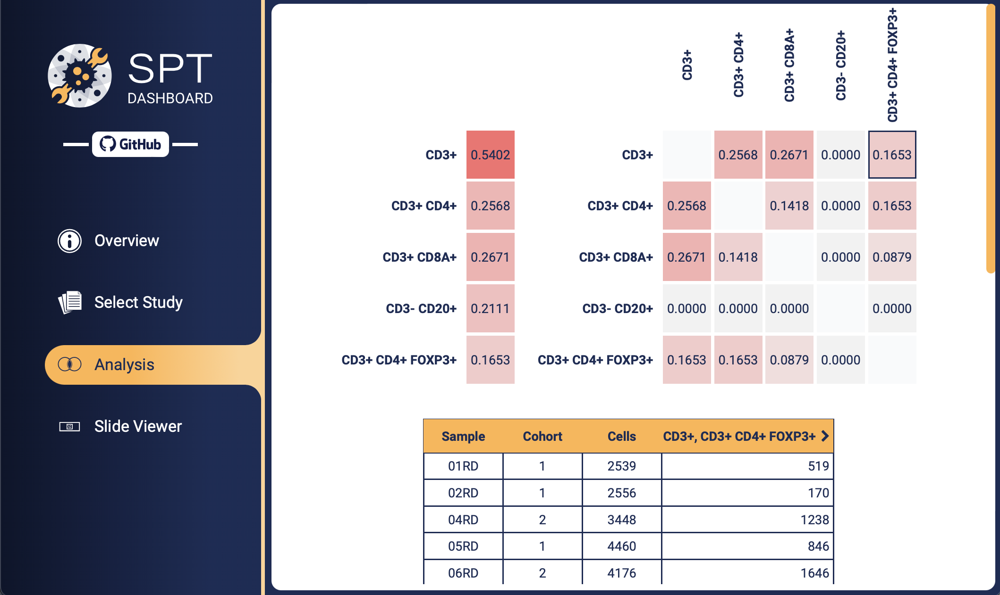
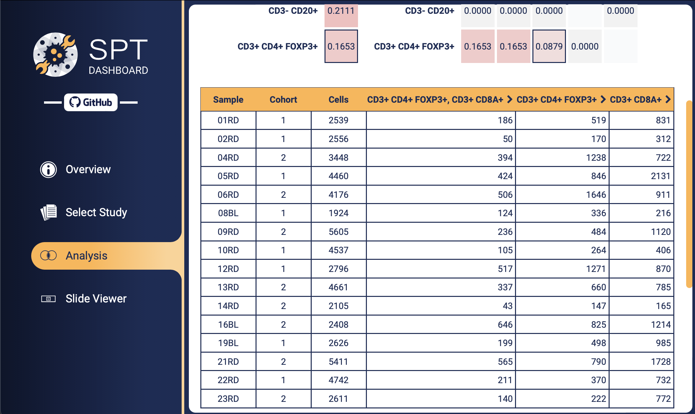
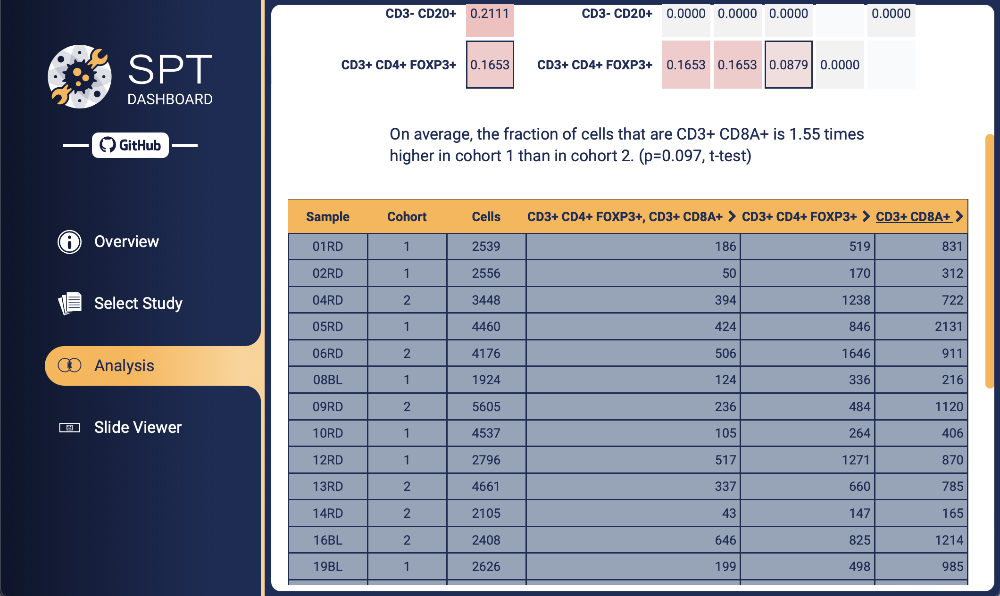
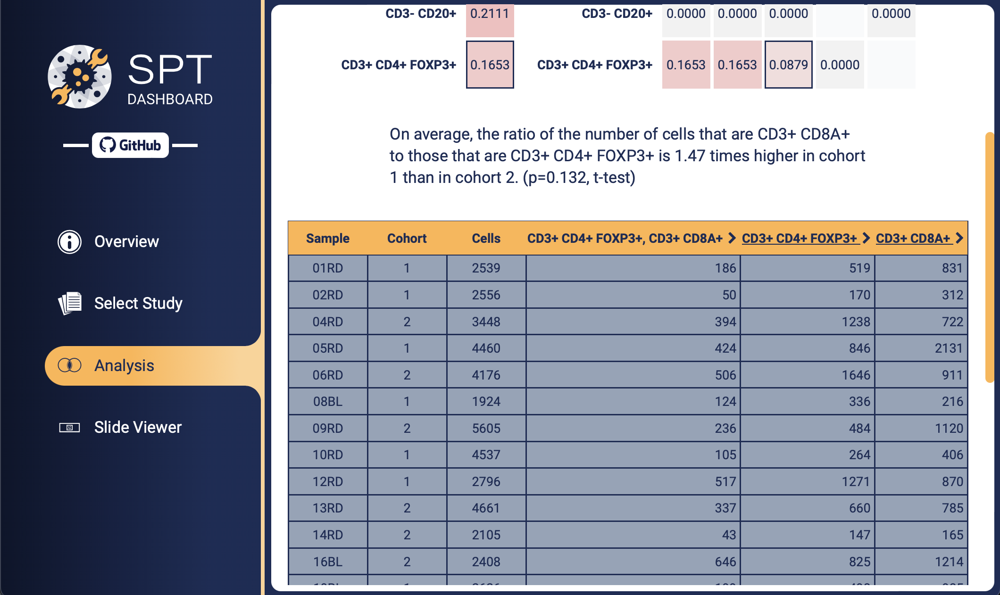
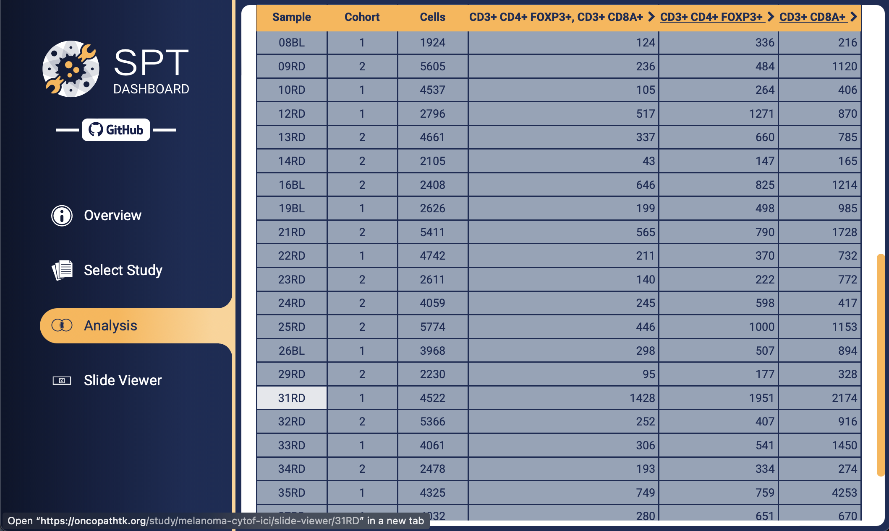
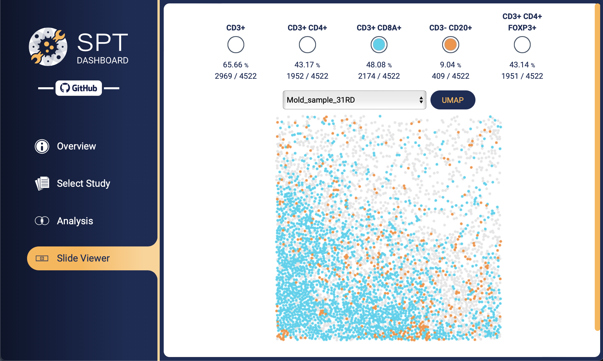
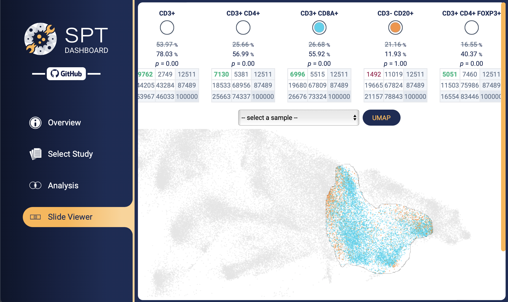

 
 

# What can cells tell us about biology and disease?

By studying microscopic imaging of small specimens of tissue, like skin or organ resections, pathologists and basic scientists can draw inferences about the way that cells coordinate to set biological processes in motion, and how these processes are disrupted in the course of disease.

The taxonomy of cell types and their functional states is surprisingly diverse, and modeling biological processes at the cellular level is consequently a rich source of new insights. Imaging methods are needed that capture some of this diversity, by measuring multiple channels of information at the same time for each cell, to provide empirical data that ensures these models make sense in realistic scenarios.

Multiple-channel imaging technology, capable of measuring several dozen protein targets, is reaching maturity. Multiplexed immunofluoresence, imaging mass cytometry, and their variants measure data similar to what is measured by flow cytometry or single-cell RNA-seq, since this is also at the single-cell level and involves multiple quantitative features, but with the crucial advantage that cell positions are also observed -- spatial context.

The Spatial Profiling Toolbox (SPT) project is about making the most of this informative data source using quality software. The guiding principles are:
- **High availability**. Datasets should be available for analysis immediately with the widest range of tools. Preprocessing and indexing should be done in advance as much as possible.
- **Reproducible analysis**. Results and findings should be based on analyses that others can easily recreate in their entirety.
- **No code**. The tools should be usable by investigators without doing any programming and without the need for specialized knowledge of computer systems.
- **Uniform data management**. Datasets should be organized with high semantic integrity, to ensure analysis can be performed on them in a consistent way and to ensure that the conclusions that are drawn are valid.

SPT is available to the public at [oncopathtk.org](https://oncopathtk.org).

# User tutorial

## Example: Exploratory data analysis of immunotherapy response in melanoma

On the main page, select **Melanoma CyTOF ICI**. This dataset was published by Moldoveanu et al.[^1].

You'll see a summary of this dataset, including the numbers of samples, cells, and channels, links to relevant publications, classification of the samples, and highlighted findings that can be observed by using the SPT application. In this case the study collected samples from patients treated with immune-checkpoint inhibitor therapy, and the patients either responded favorably or poorly to this treatment.

On the next page you can choose which cell phenotypes you want to focus on. Click one of the pre-defined phenotypes, or define a custom phenotype by indicating positive and negative markers from among the channels which were imaged.

We select five custom phenotypes. The first phenotype, for example, was defined by selecting **CD3+**. This generally indicates the T cells. The second phenotype is **CD3+ CD4+**, the markers T helper cells. We also include: **CD3+ CD8A+**, **CD3+ CD4+ FOXP3+**, and **CD20+ CD3-**. We are ascertaining the rough profile of lymphocytes in the dataset.

The next page shows the cell population breakdown with respect to the phenotypes we've just selected. Each phenotype is shown with the fraction of cells expressing that phenotype across all samples, for example 54.02% are indicated as T cells.

In the grid, each *pair* of phenotypes is shown with the fraction of cells expressing *both* phenotypes. For example, the fraction of cells that are both **CD3+ CD4+ FOXP3+** and **CD3+** is 16.53%, the same as the fraction of cells that are **CD3+ CD4+ FOXP3+**, as expected since **CD3+** is part of the signature of this phenotype (the T regulatory cells).

> [!NOTE]
> You could use this technique to make a standard heat map for assessment of clusters, by selecting all single-channel phenotypes. Depending on the size of the samples, since these metrics are computed live, this could take up to 1 minute per computed value.

To continue with a finer analysis, click one of the "tiles", either for one phenotype (the tiles on the left) or two phenotypes (the grid on the right).

We choose the tile at row **CD3+ CD4+ FOXP3+** (Treg) and column **CD3+ CD8A+** (Tc). The table below populates with the size of the population of cells expressing both signatures, broken down by sample. Note that in reality there are generally few cells expressing both of these two specific suites of markers, and the few cells occuring here are probably the result of an imperfect stain intensity dichotomization (thresholding, gating). So this tool can be used to do basic quality control in case some logical or illogical marker combinations are known in advance.

We also selected the single-phenotype tiles **CD3+ CD4+ FOXP3+** and **CD3+ CD8A**.

Click on the column header **CD3+ CD8A+** (it becomes underlined to indicate that it is selected). Then select the two cohorts by clicking one of the **1** values and one of the **2** values. A "verbalization" appears which states that the trend, according to a t-test, is that the fraction of Tc cells is increased about 1.5 times in the non-responder cohort compared to the responders, with statistical significance value p=0.01.

We click on column **CD3+ CD4+ FOXP3+**, in addition to the prior selection. A similar assessment appears, this time with respect to the ratio of the number of **CD3+ CD8A+** (the first selection) to **CD3+ CD4+ FOXP3+** (the second selection).

Let's focus our attention on one of the samples that exhibited a large fraction of Tc cells. Click **31RD**

The "virtual slide viewer" opens. Choose a few phenotypes, and the corresponding cells will become highlighted. The fraction and count of the cells for each phenotype are shown.

A UMAP dimensional reduction across the whole dataset is available in this case, by clicking **UMAP**.

You can zoom and pan the view using scroll and click-and-drag.

We spot a region that looks "saturated" with Tc cells. Select it by clicking and dragging the mouse while holding either the **Ctrl** key or (on Mac) **CMD**.

The new cell count for each phenotype is now shown, together with the new percentage, relative to the selection. In this case the Tc fraction approximately doubled, to **6996** cells (shown in green). This increase is assessed using the Fisher test (the entire contingency table is also shown, for reference). The test verifies that the increase highly statistically significant in this case, as expected.

# Data management

# CLI command reference

# API reference

# Development and maintenance

# Deployment options

[^1] Moldoveanu et al. [*Spatially mapping the immune landscape of melanoma using imaging mass cytometry*](https://doi.org/10.1126/sciimmunol.abi5072)

