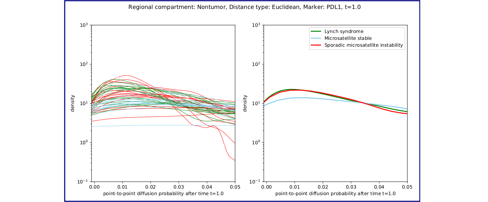

The `spatial_profiling_toolbox` (SPT) is:
  - a collection of modules that do image analysis computation in the context of histopathology, together with
  - a lightweight framework for deployment of a pipeline comprised of these modules in different runtime contexts (e.g. a High-Performance Cluster or on a single machine).

|Computation module|Description|Original author|
|------------------|-----------|---------------|
|Diffusion|The core of this module takes as input a collection of points, and generates the associated diffusion map and diffusion Markov chain, with the aim of producing features that are characteristic of the input geometry. Taken as a whole the diffusion analysis pipeline provides statistical test results and figures that assess the efficacy of diffusion-related metrics as discriminators of selected correlates.|Rami Vanguri|
|Phenotype proximity|The core of this module takes as input two collections of points, and calculates the frequency with which a pair of points from the respective collections occur near each other. Taken as a whole the phenotype proximity analysis pipeline provides statistical test results and figures that assess the efficacy of proximity-related metrics as discriminators of selected correlates.|Rami Vanguri|



# Getting started

Clone the repository, and install the Python package with `pip`:

```
pip install spatial_profiling_toolbox/
```

(You may need to install `numpy` and `cython` separately, according to the [installation instructions for Python OT](https://pythonot.github.io/#installation).)

Then run `spt-pipeline` to enter a dialog that solicits configuration parameters for your run. You will be given the option to run locally or to schedule the pipeline as [Platfrom LSF (Load Sharing Facility)](https://www.ibm.com/products/hpc-workload-management) jobs. In the LSF case, you must first build the library into a Singularity container by running

```bash
cd building && ./build_singularity_container.sh
```

and moving the container, `sat.sif`, to an area accessible to the nodes in your cluster.

If you are doing computations with lots of data, the whole pipeline might take hours to complete. If you wish to see final results based on partially-complete intermediate data, use `spt-analyze-results`.

You can test if basic functionality works in your environment by running local tests:
```bash
cd spatial_profiling_toolbox/tests
./test_proximity_pipeline.sh
```
A spreadsheet would be created in `output/` with some statistical test results on example data.

# Preparing your data

The current workflows all operate on spreadsheet files exported from the [HALO](https://indicalab.com/halo/) software. Support for more generic inputs is in the works, but for now this means that you must use something like the metadata format exemplified by the [test data](spatial_profiling_toolbox/tests/data).

# Platform

Some of the utilities depend on a Linux/Unix/macOS environment.

# Customization

See [Documentation for developers](spatial_profiling_toolbox/README.md).
