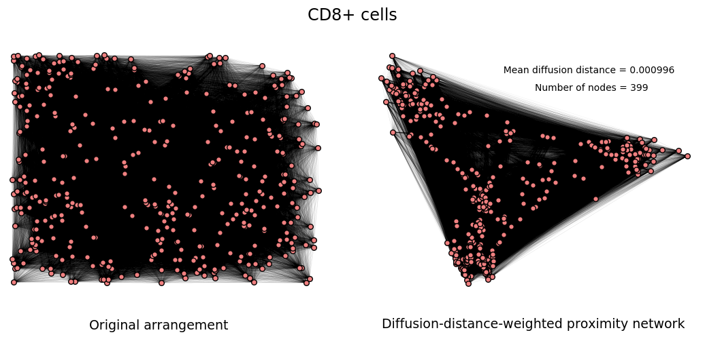
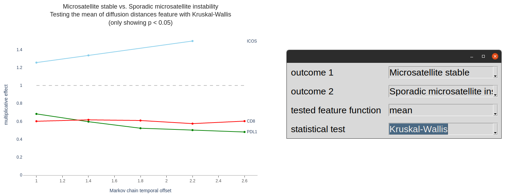

<p align="center">

</p>
<p align="center">
<a href="https://github.com/nadeemlab/SPT#Supported-workflows">Supported workflows</a>
 | <a href="https://github.com/nadeemlab/SPT#Preparing-your-data">Preparing your data</a>
 | <a href="https://github.com/nadeemlab/SPT#Prerequisites">Prerequisites</a>
 | <a href="https://github.com/nadeemlab/SPT#Getting-started">Getting started</a>
 | <a href="https://github.com/nadeemlab/SPT#Examples">Examples</a>
 | <a href="https://spatialprofilingtoolbox.readthedocs.io">Read the Docs</a>
</p>

The SPT modules do image analysis computation in the context of histopathology. For the convenience of automatic usage in different runtime contexts, the pipelines are orchestrated with [Nextflow](https://www.nextflow.io/).

Supported workflows
-------------------
- **Phenotype proximity workflow**. The core module takes as input two collections of points, and calculates the average density with which a point of one set appears within a specified distance from a given point of the other set. In a balanced/symmetric mode, it calculates instead the density of occurence of a pair of points from the respective sets within the specified distance range.
- **Density workflow**. The core module calculates phenotype density metrics, without regard to spatial information. This means cell counts per unit cell area in a given compartment or region belonging to a given phenotype.
- **Front proximity workflow**. The core module calculates the distribution of the distances between the points of a given subset and the front or boundary between two given regions.
- **Diffusion workflow**. The core module takes as input a collection of points, and generates the associated diffusion map and diffusion Markov chain, with the aim of producing features that are characteristic of the input geometry.

Preparing your data
-------------------
The current workflows all operate on spreadsheet files mimicing that of object/cell manifests exported from the [HALO](https://indicalab.com/halo/) software. The metadata format is exemplified by the [test data](https://github.com/nadeemlab/SPT/tree/main/tests/data). See also the [specification](https://github.com/nadeemlab/SPT/tree/main/schemas/file_manifest_specification_v0.5.md) for a file manifest file, used to keep all metadata for a dataset organized.

Prerequisites
-------------
The instructions are basically the same whether you will be running on your local machine, on a High-Performance Cluster for large datasets, or another runtime context, with slight differences noted where applicable.

1. Ensure a Linux/Unix-style environment (though a Windows deployment may work using [WSL](https://docs.microsoft.com/en-us/windows/wsl/about)).
2. Install Java 8+, if it is not already installed. This is needed for Nextflow. If you do not already have Nextflow installed, it will be installed by the first invocation of `spt-pipeline`.

Getting started
---------------
Install the SPT tools from [PyPI](https://pypi.org/project/spatialprofilingtoolbox/):

```sh
pip install spatialprofilingtoolbox
```

Now run

```sh
spt-pipeline configure
```

in a clean directory. You will be prompted to choose which computations to do, where the input data is stored, etc.

Then:

```sh
spt-pipeline run
```

If you just want to try this out, without [preparing your own input data](#Preparing-your-data) as described above, you can clone this repository, do `cd tests/`, and use the test data in `tests/data/` by answering the prompts as shown:

<p align="center">

</p>

You can also **skip the configuration dialog** by creating `.spt_pipeline.json` in your working directory before running `spt-pipeline`, for example copied from a previous run. Moreover if you prefer a more "Nextflow native" deployment, you can just copy the script [`spt_pipeline.nf`](spatialprofilingtoolbox/spt_pipeline.nf) and to your working directory and use Nextflow directly:

```
nextflow spt_pipeline.nf
```

#### LSF
The pipeline seamlessly supports High-Performance Clusters (HPCs) running [Platform LSF](https://www.ibm.com/products/hpc-workload-management) on which [Singularity](https://sylabs.io/singularity/) is installed. However every HPC is configured differently with respect to shared file system resources, and few HPCs allow the Docker daemon that would permit automatic container usage. For this reason it is currently necessary to manually pull the Docker container "as" a singularity container from our public registry,

```sh
singularity pull docker://nadeemlab/spt:latest
```

and move the resulting `.sif` file to a shared area accessible to the nodes in your cluster.

Now run `spt-pipeline configure` and supply the path to your SIF file.

Finally, use `spt-pipeline run`, or, more explicitly:

```sh
nextflow -c nextflow.config.lsf run spt_pipeline.nf
```

Examples
--------
The dataset analyzed in the following examples is imaging mass cytometry of breast cancer tissue microarrays, published [here](https://doi.org/10.5281/zenodo.3518283). For the purpose of phenotyping, continuous intensity values were dichotomized using a [log transformation and 2-population Gaussian mixture model](https://github.com/nadeemlab/SPT/blob/main/spatialprofilingtoolbox/environment/dichotomization.py).

### Phenotype proximity workflow

A basic question concerning the spatial information provided by cell imaging is: What characterizes the spatial relationship between the arrangements of cells belonging to two given phenotypes?

As an answer to this question, here we calculate:

**(unbalanced) phenotype proximity metric**: *The average number of cells of a given target phenotype which occur within a prescribed (pixel) distance of a given cell of a given source phenotype, the average being over all such cells, i.e. those of the source phenotype*.

High values for this metric may be due to overall higher counts for the target phenotype, as opposed to any spatial phenomenon. However, for small distance limits, comparatively high values for the proximity metric may indicate that the cells of the target phenotype are somehow attracted to or stimulated by cells of the source phenotype.

The results of this pipeline are saved to `results/stats_tests.csv`. The most significant rows for a given pair of outcome values (in this case diagonosed intrinsic subtypes) are shown below:

<p align="center">

</p>

Each row records the result of a test for statistically-significant difference between the values of the phenotype proximity metric in 2 different sample groups, when restricted to a given region or compartment of a given image when regional information is available.

### Density workflow

Some biological phenomena may be detectable already in dissociated "signal" not involving the spatial information present in images.

One of the simplest and most readily available metrics for dissociated cell populations in histology slides is:

**phenotype density**: *The fraction of the cell area occupied by cells of a given phenotype, out of the total cell area*.

The results of this pipeline are saved to `results/stats_tests.csv`. If no cell area data is provided, a default constant value is used. Example rows from this table are shown below:

<p align="center">

</p>

Each row records the result of a test for statistically-significant difference between the values of the density metric in 2 different sample groups, when restricted to a given region or compartment of a given image.

**Intensity information**. To weight cells by the intensity value of a given channel in the density calculation, set `"use_intensities" : true` in the configuration file (or answer "yes" to the configuration dialog prompt regarding intensity usage.)

### Front proximity workflow

The histology images and metadata supporting this example and the following example are a colon cancer dataset that will be made publicly available.

For a cell in a given biologically-meaningful region, distance to the front or boundary with a specific other region may be an important indicator of the probability of participation in processes of interaction between the two regions. For example, between tumor and stromal regions.

In this workflow we calculate:

**front proximity metric**: *the distance from each cell to the front between two given regions*.

The values are then stratified by cell phenotype and saved to the SQLite database `results/intermediate.db`. The table `cell_front_distances` includes columns:

- `sample_identifier`
- `fov_index`
- `outcome_assignment`
- `phenotype`
- `compartment`
- `other_compartment`
- `distance_to_front_in_pixels`

To see plots of the distributions, use:

```sh
spt-front-proximity-viz results/intermediate.db --drop-compartment="<ignorable compartment name>"
```

**Note**: *The* `--drop-compartment` *option should be provided as many times as necessary to remove from consideration all compartments/regions in excess of the two you wish to focus on. If only two compartment designations appear in your metadata files, then this option is not necessary.*

Plot rendering for about 500 MB (8 million cells) took 5 minutes on a workstation laptop. To monitor the progress, enable [debug logs](#Logs).

<p align="center">

</p>

### Diffusion workflow

[Spectral geometry](https://en.wikipedia.org/wiki/Diffusion_map) is the study of the global spatial information in a metric space discerned via the eigenanalysis of linear operators involving all points of the space. Typically the linear operators themselves are defined by the consideration of local point-to-point interactions, while the spectral decomposition is thought to represent the overall coupling of these local interactions into the coherent whole metric space.

Here we calculate the **diffusion distance**: *the distance between each pair of cells after applying the diffusion map, i.e. evaluating eigenfunctions for the Laplace operator on each cell*. This distance depends on a "pseudo-time" unit, or scale, the amount of time to run forward a diffusion process Markov chain closely related to the diffusion map.

Unless `save_graphml=False`, this pipeline saves GraphML files containing diffusion-distance-weighted networks on the cell sets belonging to a given point, located in `output/graphml/*`. Visualize them as shown below:

```sh
spt-diffusion-graphs-viz --color=lightcoral --caption="CD8+ cells" output/graphml/CD8_example.graphml
```

<p align="center">

</p>

This pipeline also saves statistical test results to `output/diffusion_distance_tests.csv` which assess the efficacy of the diffusion distance distributions as discriminators of given outcomes. To visualize the trend of the significant tests as the pseudo-time unit varies, use:

```sh
spt-diffusion-viz output/diffusion_distance_tests.csv
```

<p align="center">

</p>

