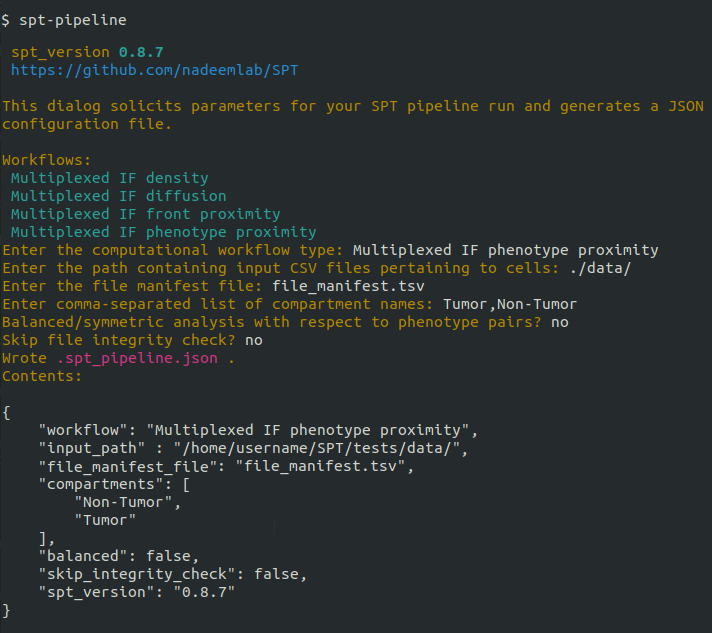
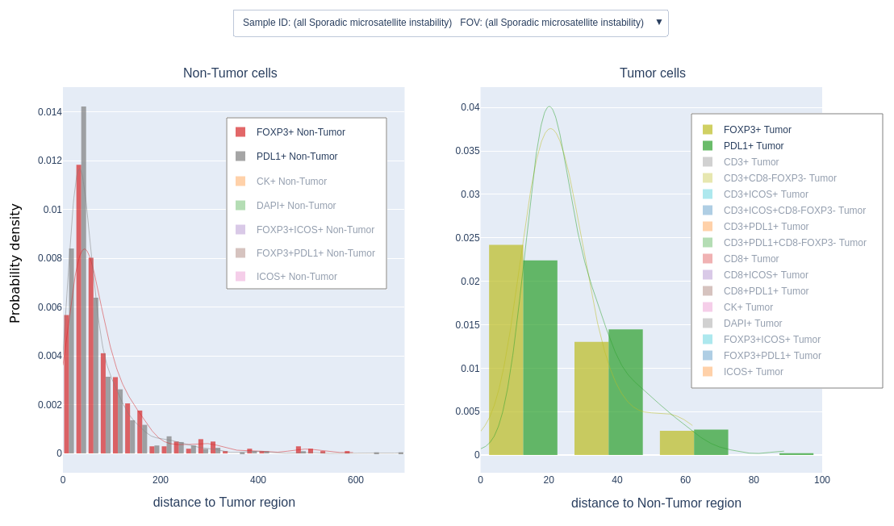

.. figure:: docs/_static/SPT_logo_blue_on_transparent.png
   :target: docs/_static/SPT_logo_blue_on_transparent.png
   :align: center
   :width: 400

(Documentation for developers on `Read the Docs <https://spatialprofilingtoolbox.readthedocs.io>`_. Documentation for `package maintainers <for_maintainers.md>`_.)

The SPT modules do image analysis computation in the context of histopathology.
A lightweight framework is also provided to deploy a pipeline comprised of these
modules in different runtime contexts (e.g. a High-Performance Cluster or on a
single local machine).

Supported workflows
-------------------

.. list-table::
   :widths: 1 3
   :align: center

   * - `Phenotype proximity workflow`_
     - | The core module takes as input two collections of points, and calculates the average density with
       | which a point of one set appears within a specified distance from a given point of the other set.
       | In a balanced/symmetric mode, it calculates instead the density of occurence of a pair of points
       | from the respective sets within the specified distance range.
   * - `Density workflow`_
     - | The core module calculates phenotype density metrics, without regard to spatial information. This
       | means cell counts per unit cell area in a given compartment or region belonging to a given phenotype.
   * - `Front proximity workflow`_
     - | The core module calculates the distribution of the distances between the points of a given subset
       | and the front or boundary between two given regions.
   * - `Diffusion workflow`_
     - | The core module takes as input a collection of points, and generates the associated diffusion map
       | and diffusion Markov chain, with the aim of producing features that are characteristic of the
       | input geometry.

Preparing your data
-------------------

The current workflows all operate on spreadsheet files exported from the `HALO <https://indicalab.com/halo/>`_ software. The metadata format is exemplified by the `test data <https://github.com/nadeemlab/SPT/tree/main/tests/data>`_. See also the `specification <https://github.com/nadeemlab/SPT/tree/main/schemas/file_manifest_specification_v0.5.md>`_ for a file manifest file, used to keep all metadata for a dataset organized.

Getting started
---------------

Install from `PyPI <https://pypi.org/project/spatialprofilingtoolbox/>`_::

    pip install spatialprofilingtoolbox

All workflows are configured by running ``spt-pipeline`` in your desired run directory.

**Note**: *You will be given the option to run locally or to schedule the pipeline as* `Platform LSF <https://www.ibm.com/products/hpc-workload-management>`_ *jobs. In the LSF case, assuming your administrators have installed* `Singularity <https://sylabs.io/singularity/>`_ *, you must first pull the Singularity container from Docker Hub using* ::

    singularity pull docker://jimmymathews/spt:0.7.19

*(using the correct version number) and moving the container ``.sif`` file to an area accessible to the nodes in your cluster.*

Example answers to the ``spt-pipeline`` prompts are shown below for the phenotype proximity workflow, using the test data that ships with the SPT source code. There are slight variations depending on the workflow.

The parameters selected during the dialog are saved in a configuration file called ``.spt-pipeline.config``:

.. code-block:: ini

   [default]
   workflow = Multiplexed IF phenotype proximity
   job_working_directory = ./SPT/
   input_path = ./SPT/tests/data
   outcomes_file = ./SPT/tests/data/diagnosis.tsv
   output_path = ./SPT/output
   jobs_path = ./SPT/jobs
   logs_path = ./SPT/logs
   schedulers_path = ./SPT/
   sif_file = ./SPT/building/spt_v0.5.69_08-17-2021_17-07.sif
   file_manifest_file = ./SPT/tests/data/file_manifest.tsv
   runtime_platform = local
   elementary_phenotypes_file = ./SPT/tests/data/elementary_phenotypes.csv
   complex_phenotypes_file = ./SPT/tests/data/complex_phenotypes.csv
   excluded_hostname = none
   save_graphml = True

   [static]
   version = 0.5.69

For headless (that is, non-interactive) runs, just save the desired parameters in ``.spt-pipeline.config``. The next call of ``spt-pipeline`` will initiate the pipeline rather than the configuration dialog.

After all jobs have completed, use ``spt-analyze-results`` to do the final aggregation step and to run statistical tests. You can also use ``spt-analyze-results`` *before* all jobs have completed, to see final results based on partially-completed intermediate data.

Examples
--------
The histology images and metadata supporting the following examples are a colon cancer dataset that will be made publicly available.

.. _phenotype-proximity-workflow:

Phenotype proximity workflow
^^^^^^^^^^^^^^^^^^^^^^^^^^^^
A basic question concerning the spatial information provided by multiplexed images of cells is: What characterizes the spatial relationship between the arrangements of cells belonging to two given phenotypes?

As one possible answer to this question, here we calculate the **(unbalanced) phenotype proximity metric**: *the average number of cells of a given target phenotype which occur within a prescribed (pixel) distance of a given cell of a given source phenotype, the average being over all such cells, i.e. those of the source phenotype*.

High values for this metric may be due to overall higher counts for the target phenotype, as opposed to any spatial phenomenon. However, for small distance limits, comparatively high values for the proximity metric may indicate that the cells of the target phenotype are somehow attracted to or stimulated by cells of the source phenotype.

The results of this pipeline are saved to ``output/phenotype_2_phenotype_proximity_tests.csv``. Example rows from this table are shown below:

Each row records the result of a test for statistically-significant difference between the values of the phenotype proximity metric in 2 different sample groups, when restricted to a given region or compartment of a given image.

.. _density-workflow:

Density workflow
^^^^^^^^^^^^^^^^
Some biological phenomena may be detectable already in dissociated "signal" not involving the spatial information present in images.

One of the simplest and most readily available metrics for dissociated cell populations in histology slides is the **phenotype density**: *the fraction of the cell area occupied by cells of a given phenotype, out of the total cell area*.

The results of this pipeline are saved to ``output/density_tests.csv``. Example rows from this table are shown below:

.. image:: docs/_static/density_example.png
   :target: docs/_static/density_example.png

Each row records the result of a test for statistically-significant difference between the values of the density metric in 2 different sample groups, when restricted to a given region or compartment of a given image.

.. _front-proximity-workflow:

Front proximity workflow
^^^^^^^^^^^^^^^^^^^^^^^^
For a cell in a given biologically-meaningful region, distance to the front or boundary with a specific other region may be an important indicator of the probability of participation in processes of interaction between the two regions. For example, between tumor and stromal regions.

In this workflow we calculate the **front proximity metric**: *the distance from each cell to the front between two given regions*. The values are then stratified by cell phenotype and saved to the file ``output/front_proximity.db``.

To see plots of the distributions, use:

.. code-block:: bash

   spt-front-proximity-viz output/front_proximity.db --drop-compartment="<ignorable compartment name>"

**Note**: *The* ``--drop-compartment`` *option should be provided as many times as necessary to remove from consideration all compartments/regions in excess of the two you wish to focus on. If only two compartment designations appear in your metadata files, then this option is not necessary.*

.. _diffusion-workflow:

Diffusion workflow
^^^^^^^^^^^^^^^^^^
`Spectral geometry <https://en.wikipedia.org/wiki/Diffusion_map>`_ is the study of the global spatial information in a metric space discerned via the eigenanalysis of linear operators involving all points of the space. Typically the linear operators themselves are defined by the consideration of local point-to-point interactions, while the spectral decomposition is thought to represent the overall coupling of these local interactions into the coherent whole metric space.

Here we calculate the **diffusion distance**: *the distance between each pair of cells after applying the diffusion map, i.e. evaluating eigenfunctions for the Laplace operator on each cell*. This distance depends on a "pseudo-time" unit, or scale, the amount of time to run forward a diffusion process Markov chain closely related to the diffusion map.

Unless ``save_graphml=False``, this pipeline saves GraphML files containing diffusion-distance-weighted networks on the cell sets belonging to a given point, located in ``output/graphml/*``. Visualize them as shown below:

.. code-block:: bash

   spt-diffusion-graphs-viz --color=lightcoral --caption="CD8+ cells" output/graphml/CD8_example.graphml

.. image:: docs/_static/diffusion_graphs_viz_example.png
   :target: docs/_static/diffusion_graphs_viz_example.png

This pipeline also saves statistical test results to ``output/diffusion_distance_tests.csv`` which assess the efficacy of the diffusion distance distributions as discriminators of given outcomes. To visualize the trend of the significant tests as the pseudo-time unit varies, use:

.. code-block:: bash

   spt-diffusion-viz output/diffusion_distance_tests.csv

.. image:: docs/_static/diffusion_tests_example.png
   :target: docs/_static/diffusion_tests_example.png

