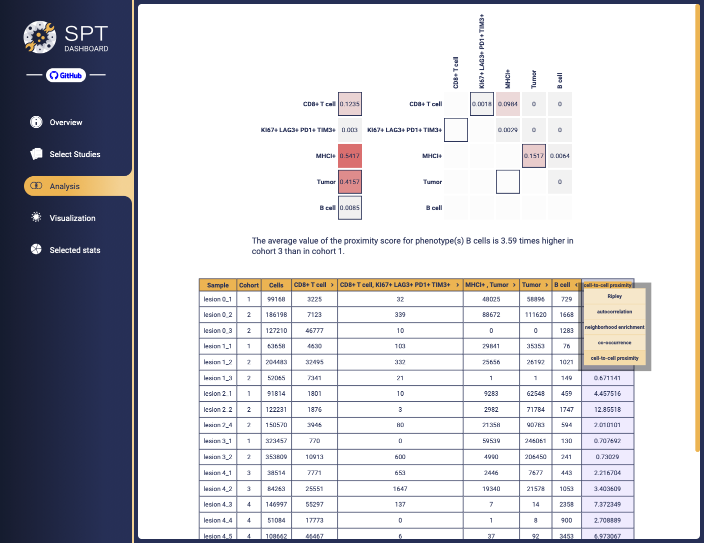

# spt-dashboard
## Baseline frontend and infrastructure for Spatial Profiling Toolbox

This repository contains a web application which is largely composed of the components provided by [spatialprofilingtoolbox](https://github.com/nadeemlab/SPT).

| Directory                   | Description                                      |
|-----------------------------|--------------------------------------------------|
| [deployment](deployment/)   | various deployment and infrastructure scripts    |
| [application](application/) | JS frontend for the SPT application              |
| [doc](doc/)                 | some DB related documentation and app checklists |



## Run the application locally with test services

Use the Docker composition, for example as follows (adjusted according to your environment):
```sh
cd application
docker compose up
```

Once started, open a browser with expanded local privileges:

```sh
bash deployment/open_browser_no_security.sh
```
