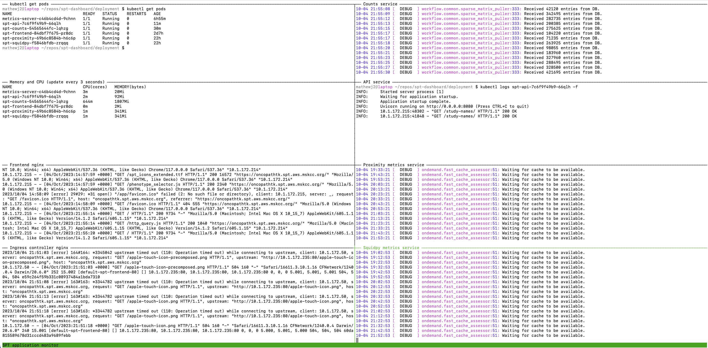

This is more detailed deployment documentation for *spt-dashboard*

Folders below contain some parts of the deployment and corresponding scripts
1. *experimental* - Few experimental configurations for the infrastructure (Docker compose, ECS, EKSCTL).
2. *terraform* - Terraform files for creating required infrastructure on AWS Cloud (EKS cluster, RDS PostgreSQL database, ECS container registry and other entities necessary)
3. *helm* - HELM Charts for automated deployment of the applications (dependant on values from Terraform).
4. *k8s* - Kubernetes YAML files for manual deployment and experiments.
5. *scripts* - Some useful scripts to deploy the application on AWS (MSK managed infrastructure)

Also it contains documents on how to handle and automate some devops tasks
1. [Terraform infrastructure for AWS](terraform/TERRAFORM_DEPLOYMENT_README.md)
2. [Helm deployment for Kubernetes infastructure](helm/HELM_DEPLOYMENT_README.md)


## Build the frontend container

```sh
cd deployment
bash build_image.sh
```

## Configuring the console session for AWS

Before you do anything related to AWS you should authorized your console session by [retrieving credentials](login.sh):

```sh
cd deployment
source login.sh
```


## Update the frontend container

To update the frontend container in the Elastic Container Repository (ECR), use:

```sh
cd deployment
bash push_frontend_container.sh
```

If this fails due to outdated identifiers etc., try:

1. Logging in to AWS and going to the [ECR repository area](https://us-east-1.console.aws.amazon.com/ecr/repositories?region=us-east-1).
2. Click *View push commands*.


## Monitor the production application

After retrieving AWS credentials, you can monitor the application components with `monitor.sh`.

This script uses [tmux](https://github.com/tmux/tmux/wiki).

```bash
cd deployment
bash monitor.sh
```



- To exit the monitor, in any of the terminal windows use `tmux kill-session`.
- To cycle through the windows, use `Control b` then `o` or arrow keys.
- To scroll with the arrow keys in a given window, use `Control b` then `[`, and `q` when you're done.  
